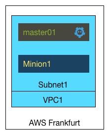

### tf-cs-aws
Nano k8s stack:
- 1 VPC
- 1 Subnet
- 1 Master
- 1 worker


 
 
Will auto provision and build in AWS. Use variables.tf file to adjust settings (works in all AWS regions). Will auto generate self signed certificates and use for communication.

### Known issues

 1. Certificate is self-signed, so you will need to add `insecure-skip-tls-verify` to be true in your kubectl config

### Pre-Requisites
 1. Create your API key and Secret key in ~/.terraform/api_key and ~/.terraform/secret_key
 2. Edit main.tf to point to these files, and adjust your URL to point to your AWS Account and region
 3. Edit variables.tf to suit your environment
 4. Have kubectl installed: `wget https://storage.googleapis.com/kubernetes-release/release/v1.3.0/bin/darwin/amd64/kubectl`

### Usage
 1. Clone this repo
 2. Type `terraform apply`
 3. Choose a cluster name, for example, `sbpt` or `andy`
 4. Your cluster should build, and should output something similar to:

```
Apply complete! Resources: 19 added, 0 changed, 0 destroyed.

The state of your infrastructure has been saved to the path
below. This state is required to modify and destroy your
infrastructure, so keep it safe. To inspect the complete state
use the `terraform show` command.

State path: terraform.tfstate

Outputs:

  addresses = Master IP addresses are 52.209.188.216 and worker IP addresses are 52.49.119.197
```

- Configure your kubectl to talk to the cluster using the following commands, replacing the IP address with the output shown above:

- `kubectl config set-cluster my-cluster --server=https://$IPADDRESS:6443 --insecure-skip-tls-verify=true`
- `kubectl config set-credentials my-user --token=changeme`
- `kubectl config set-context my-context --cluster=my-cluster --user=my-user`
- `kubectl config use-context my-context`


- You should now be able to use your Kubernetes cluster:

 `kubectl get cs`

```
NAME                 STATUS    MESSAGE              ERROR
controller-manager   Healthy   ok
scheduler            Healthy   ok
etcd-0               Healthy   {"health": "true"}
```

 `kubectl get nodes`

```
NAME         STATUS    AGE
10.0.1.129   Ready     16s
```

